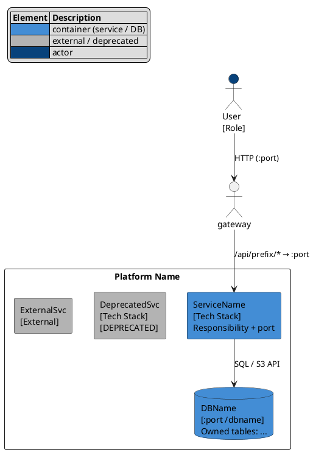
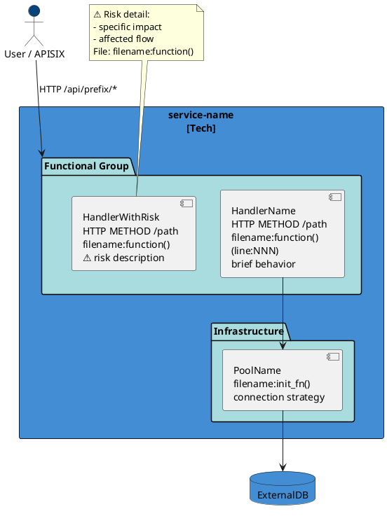

# Stage K — Diagram Suite

Tujuan:

- generate diagram arsitektur PlantUML dan png dari artifacts rekonstruksi yang sudah terverifikasi
- hasilkan diagram yang **akurat** (evidence-backed), **navigable** (per-topik + konsolidasi), dan **security-aware** (⚠️ inline)

Kapan dijalankan:

- setelah Stage H (reference design v0.1 tersedia), atau
- setelah Stage I bila critical area perlu diagram ter-update, atau
- setiap kali artifact input (03, 04, 05, 07, 08, 09, 10, 12) berubah signifikan

Input minimum:

- `03-main-spine.md` — services, key abstractions, security model
- `04-runtime-map.md` — containers, ports, deployment units
- `09-component-map.md` — komponen per service, dependencies
- `10-code-trace-map.md` — file:line refs per handler/function

Input preferred:

- `05-behavior-spine.md` — flows, branch logic, failure paths (untuk dataflow diagrams)
- `07-domain-map.md` — bounded contexts, owned tables (untuk context enrichment)
- `08-contract-map.md` — endpoints, break risk (untuk ⚠️ High pada contract)
- `12-drift-ambiguity-report.md` — CRITICAL/HIGH drift items → sumber ⚠️ annotations

## Output

Generated from BUBAT-R Stage K.

| File                                | Type             | Purpose                                                                | Primary Input                       |
| ----------------------------------- | ---------------- | ---------------------------------------------------------------------- | ----------------------------------- |
| `diagrams/c4-container.puml`        | C4 Container     | Container diagram: semua services, ports, tables, deprecated, external | 04-runtime-map                      |
| `diagrams/c4-component-{svc}.puml`  | C4 Component     | Per service: handler components + security ⚠️ + line refs              | 09-component-map, 10-code-trace-map |
| `diagrams/read-path-dataflow.puml`  | Dataflow         | Semua read flows konsolidasi (flow header per flow)                    | 05-behavior-spine                   |
| `diagrams/write-path-dataflow.puml` | Dataflow         | Semua write flows konsolidasi                                          | 05-behavior-spine                   |
| `diagrams/read-path-{topic}.puml`   | Dataflow (topic) | Per topik, satu flow per file (navigable)                              | 05-behavior-spine                   |
| `diagrams/write-path-{topic}.puml`  | Dataflow (topic) | Per topik                                                              | 05-behavior-spine                   |
| `diagrams/README.md`                | Index            | Index diagram: file, purpose, input artifact                           | —                                   |
| png (generated)                     | Image            | PNG generated dari puml di atas                                        | —                                   |

Write output to this stage directory first, then after stage done, copy to target repo:

```bash
cp -r STAGES/K/diagrams/ <target>/reconstruction/diagrams/
```

Topic naming: `storage`, `catalog`, `query`, `managed`, `pipeline`, `ext-connection`, `lifecycle`

## Aturan Kualitas (WAJIB)

### 1. Evidence-Backed Only

Setiap element di diagram WAJIB dapat ditelusuri ke:

- evidence ID dari `01-evidence-catalog.md` (EV-xxx), atau
- section artifact rekonstruksi (03/04/05/07/08/09/10)

Elemen yang hanya ada di dokumen lama (aspirasional, belum terverifikasi) TIDAK BOLEH masuk — kecuali ditandai eksplisit dengan warna `#FFE0B2` dan label `[ASPIRATIONAL]`.

### 2. Container Completeness

- Setiap container dari `04-runtime-map.md` WAJIB muncul di `c4-container.puml`
- Container deprecated/secondary: warna `#B3B3B3`
- External services (di luar repo): warna `#B3B3B3`
- Port number, DB/bucket name WAJIB dicantumkan bila diketahui dari evidence
- Semua routes APISIX (atau gateway equivalent) WAJIB tercantum lengkap

### 3. Security Annotation Mandatory

Setiap item CRITICAL atau HIGH dari `12-drift-ambiguity-report.md` WAJIB ada `⚠️` di diagram:

- di label komponen bila menyangkut single component
- di `note` block bila menyangkut flow atau policy
- TIDAK BOLEH disembunyikan demi "kebersihan" diagram

Contoh:

```puml
component "Query Executor\nPOST /query\nmain.py:execute_query()\n⚠️ arbitrary SQL — injection risk" as h_query
```

### 4. Line Reference Mandatory

Setiap component handler di `c4-component-*.puml` WAJIB menyertakan:

```
ComponentName\nfilename:function()\n(line:NNN)
```

dari `10-code-trace-map.md`. Bila line belum diketahui, tulis `(line:?)` — jangan dihapus.

### 5. C4 PlantUML Syntax

Component diagrams:

- Gunakan `package "Name" as id #A9DCDF { component "..." as id }` — bukan `rectangle` nested
- Actor entry: `actor "User / Gateway" as client #08427B`
- External systems: `database/rectangle` di LUAR container boundary `{}`

Container diagram:

- Gunakan `rectangle` untuk services, `database` untuk storage
- Satu sistem boundary: `rectangle "Platform" as boundary #ffffff {}`

### 6. Color Palette (enforced)

| Elemen                       | Kode Warna | Konteks                                 |
| ---------------------------- | ---------- | --------------------------------------- |
| Active container/component   | `#438DD5`  | services, DBs dalam kontrol sistem      |
| Component package background | `#A9DCDF`  | `package` background di c4-component    |
| External / deprecated        | `#B3B3B3`  | external systems, deprecated services   |
| Actor (person)               | `#08427B`  | user/actor node                         |
| Policy / constraint zone     | `#FFF3E0`  | COW engine, invariant block, error zone |
| Read-path flow header        | `#E3F2FD`  | `rectangle "Flow N: ..." as fN #E3F2FD` |
| Write-path flow header       | `#E8F5E9`  | `rectangle "Flow N: ..." as fN #E8F5E9` |
| Aspirasional (unverified)    | `#FFE0B2`  | belum ada bukti dari rekonstruksi       |

### 7. Branch Logic Visible di Dataflow

Setiap branching yang mengakibatkan different data path WAJIB divisualisasikan eksplisit:

```puml
rectangle "[BRANCH]\ncondition?" as branchN
branchN -down-> pathA : "YES → ..."
branchN -right-> pathB : "NO → ..."
```

Bukan hanya sequential arrows. Minimal: setiap `if/else` yang memilih backend berbeda harus tampak.

### 8. Dual Granularity Output (wajib)

Selalu produce dua layer:

- **Konsolidasi** (`*-dataflow.puml`): semua flows dalam satu file, flow header zone per flow — untuk overview dan cross-flow comparison
- **Per-topik** (`*-path-{topic}.puml`): satu flow per file, lebih verbose — untuk navigasi cepat, reference individu, dan diagram embed di doc

## Format per Diagram

### c4-container.puml

Template structure:



Wajib cantumkan:

- Semua runtime units dari `04-runtime-map.md`
- Port numbers dan DB/bucket names dari evidence
- Semua gateway routes lengkap
- Arrow label: protocol + direction context

### c4-component-{svc}.puml

Template structure:



### read/write-path-dataflow.puml (konsolidasi)

Structure per flow:

```puml
' ── Flow N: Name ──
rectangle "Flow N: {Name}" as fN_title #{E3F2FD|E8F5E9}

actor_or_src -right-> gateway : "METHOD /path"
note right: request schema
gateway -right-> svc : proxy
svc -right-> branch : "[BRANCH] condition?"
branch -down-> pathA : "YES → ..."
branch -right-> pathB : "NO → ..."
pathA -right-> db1 : "operation"
note right
  Policy:
  [VALIDASI] ...
  [VERIFIKASI] ...
  [SECURITY] ⚠️ ...
  File: filename:function()
end note
svc -right-> result : "response schema"
```

### read/write-path-{topic}.puml (per-topik)

- Satu flow lengkap dengan semua branches
- Policy note WAJIB: [VALIDASI], [VERIFIKASI], [SECURITY], [PERFORMANCE] jika ada
- `⚠️` inline di note bila ada risk
- Legend bottom dengan file:line refs:
  ```puml
  legend bottom
    File locations:
    service/filename.ext:
      functionName:lineN — description
  endlegend
  ```

### diagrams/README.md

Format:

```markdown
# Diagram Index

Seperti section `### Output` di atas.

## ⚠️ Security Annotations

All `⚠️` markers trace to `12-drift-ambiguity-report.md`.
```

## Incremental Update Protocol

Bila menjalankan Stage K ulang setelah satu artifact berubah:

| Changed artifact               | Regenerate                                              |
| ------------------------------ | ------------------------------------------------------- |
| `04-runtime-map.md`            | `c4-container.puml`                                     |
| `09-component-map.md`          | `c4-component-{svc}.puml` untuk service yang berubah    |
| `10-code-trace-map.md`         | semua `c4-component-*.puml` (line refs berubah)         |
| `05-behavior-spine.md`         | `*-path-dataflow.puml` + per-topic yang terpengaruh     |
| `12-drift-ambiguity-report.md` | semua files (⚠️ annotations bisa berubah)               |
| `08-contract-map.md`           | `c4-container.puml` + per-topic path files yang relevan |

## Exit Criteria

- semua containers dari `04-runtime-map.md` ada di `c4-container.puml`
- semua deprecated/external services ditampilkan (warna `#B3B3B3`)
- semua component groups dari `09-component-map.md` ada di component diagrams yang sesuai
- semua CRITICAL/HIGH dari `12-drift-ambiguity-report.md` punya `⚠️` di diagram
- semua handler components punya line ref dari `10-code-trace-map.md` (atau explicit `?`)
- consolidated dataflow + per-topic files keduanya ada
- tidak ada elemen tanpa evidence trace (atau explicit `[ASPIRATIONAL]`)
- `diagrams/README.md` ter-update
- Workflow Status updated untuk Stage K

## AST Index Commands

Stage K primarily reads from reconstruction artifacts, not raw code. AST index digunakan hanya untuk memverifikasi line refs sebelum ditulis ke diagram:

```bash
ast-index symbol "FunctionName"        # verify line ref sebelum tulis ke diagram
ast-index outline path/to/file         # get handler list + line numbers per file
ast-index refs "Symbol"                # verify symbol location bila line ref ragu
```

Gunakan `rg` untuk verify literal/config values yang akan masuk ke label diagram:

```bash
rg "MINIO_DEFAULT_BUCKET|PORT|:8" compose.yml    # verify port + bucket names
rg "def function_name|func functionName" service/ # verify line number
```
