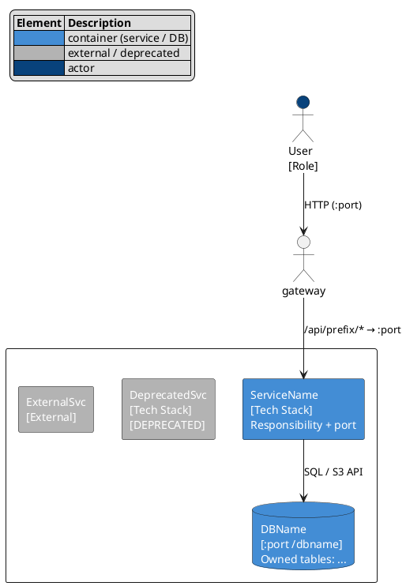
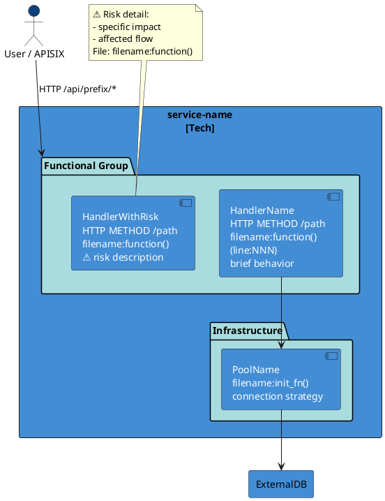
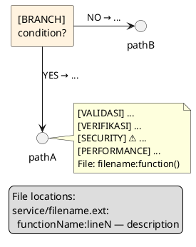

# puml-diagram

Generate PlantUML diagram files and PNG renders for BUBAT-R Stage K.

## Trigger

User types `diagram K` or Stage K agent needs to write `.puml` files.

## File Templates

### c4-container.puml



Wajib cantumkan: semua runtime units dari `04-runtime-map.md`, port numbers, DB/bucket names, semua gateway routes, arrow label dengan protocol + direction.

### c4-component-{svc}.puml



Rules:
- Gunakan `package "Name" as id #A9DCDF { component ... }` — bukan `rectangle` nested
- External systems di LUAR container boundary `{}`
- Setiap handler WAJIB punya line ref: `(line:NNN)` atau `(line:UNKNOWN)` — jangan dihapus

### read/write-path-dataflow.puml (konsolidasi)

```puml
@startuml {project}-read-path-dataflow
top to bottom direction

' ── Flow N: Name ──
rectangle "Flow N: {Name}" as fN_title #E3F2FD

actor_or_src -down-> gateway : "METHOD /path"
note right: request schema
gateway -down-> svc : proxy
rectangle "[BRANCH]\ncondition?" as branchN #FFF3E0
svc -down-> branchN
branchN -down-> pathA : "YES → ..."
branchN -right-> pathB : "NO → ..."
pathA -down-> db1 : "operation"
note right
  Policy:
  [VALIDASI] ...
  [VERIFIKASI] ...
  [SECURITY] ⚠️ ...
  File: filename:function()
end note
db1 -down-> result : "response schema"

' ── paksa urutan vertikal antar flow ──
fN_title -[hidden]down-> fM_title

' ── Flow M: Name ──
rectangle "Flow M: {Name}" as fM_title #E3F2FD
' ... dst
@enduml
```

Write-path header warna: `#E8F5E9`. Read-path: `#E3F2FD`.

### read/write-path-{topic}.puml (per-topik)



## Arrow Direction Rules

| Konteks | Arrow |
|---------|-------|
| Flow utama (request → service → DB → response) | `-down->` |
| Branch YES path | `-down->` |
| Branch NO / parallel path | `-right->` atau `-left->` |
| Antar flow section di consolidated file | `fN_title -[hidden]down-> fM_title` |

## Auto-generate PNG

Setelah semua `.puml` ditulis:

### 1. Detect PlantUML JAR

Cari di urutan ini:
```bash
find /opt/homebrew -name "plantuml.jar" 2>/dev/null | head -1
find ~/.vscode/extensions -name "plantuml.jar" 2>/dev/null | head -1
which plantuml
brew --prefix plantuml 2>/dev/null
```

Bila tidak ada: `brew install plantuml`

### 2. Generate

```bash
cd STAGES/K/diagrams/
java -Djava.awt.headless=true -jar /path/to/plantuml.jar -tpng "*.puml" -o png/
```

### 3. Verify

- exit code = 0
- setiap PNG file size > 1000 bytes (bukan error overlay)

Bila gagal: perbaiki syntax `.puml`, ulang.

### 4. Export ke reconstruction

Jangan copy manual. Jalankan `bubat-r export <target-path> stages K` setelah PNG sukses ter-generate.

## Syntax Rules (PNG error prevention)

| Larangan | Contoh salah | Perbaikan |
|----------|-------------|-----------|
| Inline rectangle di arrow target | `src -> rectangle "X" as a #C : "label"` | Deklarasi rectangle dulu, baru arrow |
| `?` di luar string | `WHERE id=?` | Ganti ke `WHERE id = :id` |
| `database` keyword di dataflow | `database "DB" as db` | Gunakan `rectangle "DB" as db` |
| `(line:?)` di label | `(line:?)` | Ganti ke `(line:UNKNOWN)` |
| Duplicate `@startuml` name | dua file pakai nama sama | Setiap file harus punya nama unik |
